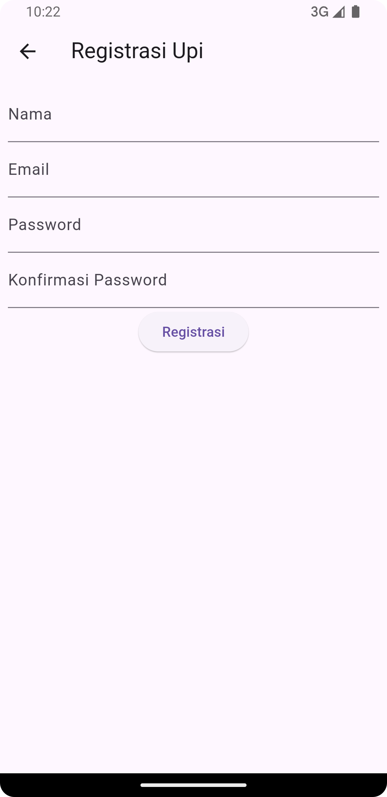
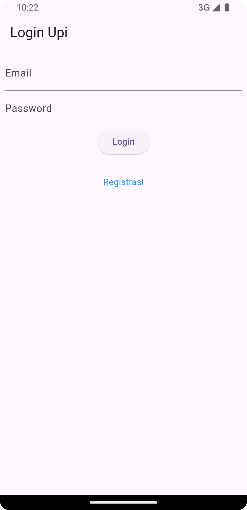
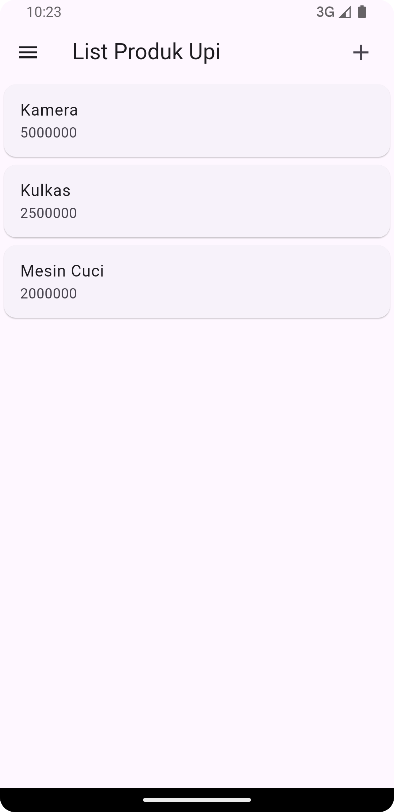
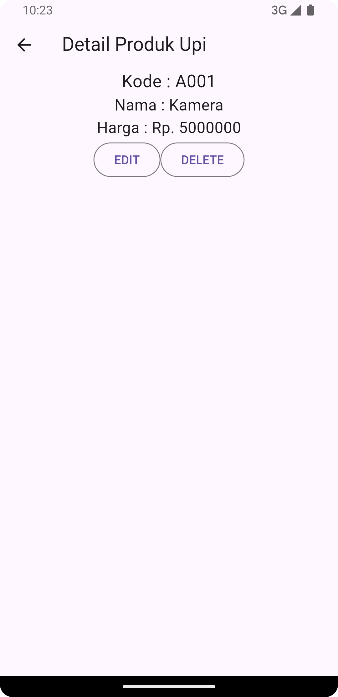
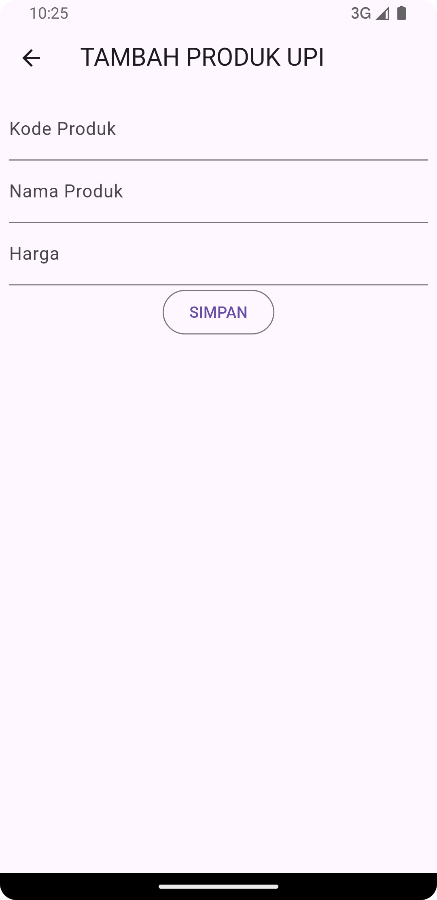
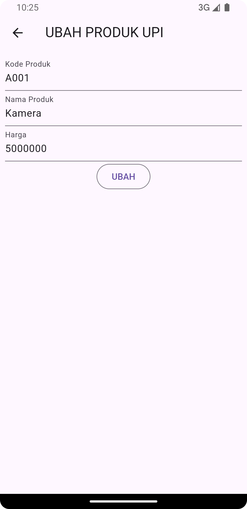
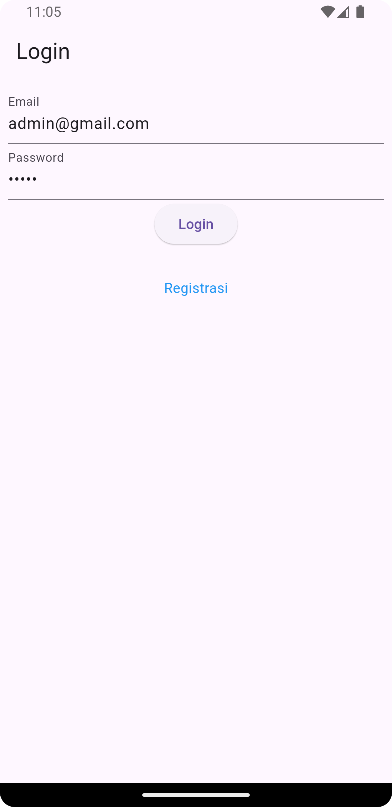
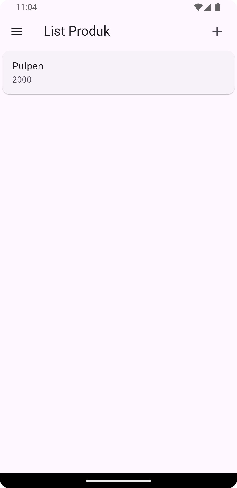
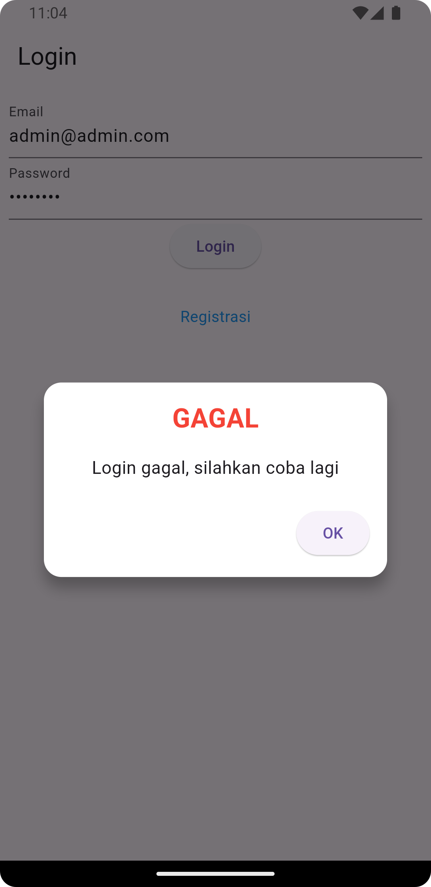

<<<<<<< HEAD
# Tugas Pertemuan 5
=======
# Tugas Pertemuan 4
>>>>>>> 570a8828a6d3db2ca68e759ed835c2423cddd13b

- **Nama** : Luthfi Arie Zulfikri
- **NIM** : H1D022061
- **Shift Lama** : A
- **Shift Baru** : A

---

# Screenshot Halaman UI

<p align="center">
  
  
</p>

<p align="center">
  
  
</p>

<p align="center">
  
  
</p>

---

# Penjelasan Proses Aplikasi

## 1. Halaman Login

### a. Form Login
<p align="center">
  
</p>

Pada halaman ini, user akan memasukkan email dan password pada form login. Setelah form diisi, tombol **"Login"** ditekan, yang akan memvalidasi form terlebih dahulu. Jika validasi berhasil, fungsi `_submit()` akan dipanggil untuk mengirim data. Data ini kemudian dikirim ke fungsi `LoginBloc.login()` dan diteruskan ke server backend API untuk verifikasi.

### b. Popup Berhasil/Gagal
<p align="center">
  
  
</p>

Jika login berhasil (kode respon `value.code == 200`), token dan `userID` disimpan menggunakan `UserInfo()` dan user diarahkan ke halaman produk (`ProdukPage`).

```dart
if (value.code == 200) {
  await UserInfo().setToken(value.token.toString());
  await UserInfo().setUserID(int.parse(value.userID.toString()));
  Navigator.pushReplacement(
    context,
    MaterialPageRoute(builder: (context) => const ProdukPage())
  );
}
```

Jika login gagal, sebuah dialog muncul (`WarningDialog`) yang menampilkan pesan **"Login gagal, silahkan coba lagi"**.

```dart
else {
  showDialog(
    context: context,
    builder: (BuildContext context) => const WarningDialog(
      description: "Login gagal, silahkan coba lagi",
    )
  );
}
```